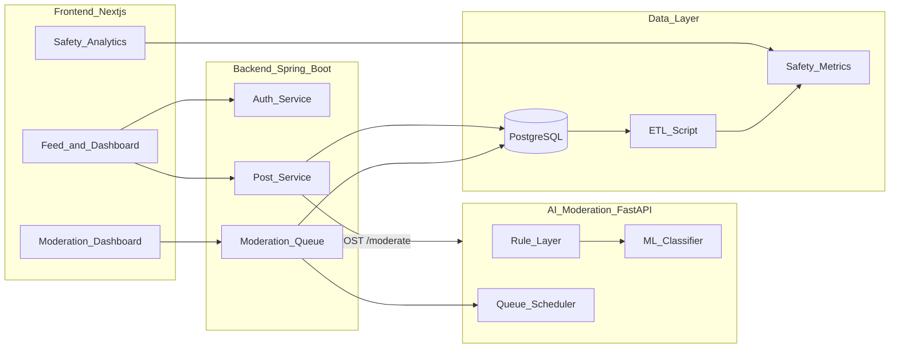

# Phase 2 — System Design

## Architecture Overview

KNUST Pulse follows a microservice-oriented monorepo layout with four deployable components and one analytics pipeline.



## Component Decomposition

| Component | Responsibility | Tech |
|-----------|----------------|------|
| `frontend/` | User interface, auth session, feed, moderation panel, analytics charts | Next.js 16, React 19, Tailwind |
| `backend-core/` | REST API, JWT auth, post lifecycle, moderation orchestration | Spring Boot 3.3, JPA |
| `ai-moderation-engine/` | Rule scoring, ML classification, queue priority endpoint | FastAPI, scikit-learn |
| `database/` | Schema, enums, seed data | PostgreSQL |
| `analytics/` | ETL extraction, aggregation, CSV/metrics output | Pandas, NumPy |

## Data Flow — Post Creation

1. User submits post content via frontend.
2. Backend validates auth and persists post with `PENDING` status.
3. Backend calls `POST /moderate` on the AI service with post text.
4. AI service returns `score`, `flagged_reason`, and `action` (APPROVE / REVIEW / REMOVE).
5. Backend writes `moderation_logs` row and updates `posts.status`.
6. Frontend refreshes feed (published posts only) or shows moderation feedback.

## Abstraction Model

```
User ──creates──> Post ──triggers──> ModerationLog
  │                    │
  │                    └──belongs_to──> Community
  │
  └──reports──> Report ──references──> Post

ModerationLog: { ai_score, flagged_reason, reviewed_by, final_decision }
Post: { content, status: PENDING|PUBLISHED|FLAGGED|REMOVED, author, community }
```

## Security Model

- JWT bearer tokens issued on login; stored in frontend localStorage.
- Role-based access: `STUDENT`, `ACADEMIC_STAFF`, `ADMIN_STAFF`, `PROJECT_STAFF`.
- Moderation queue and analytics restricted to `ADMIN_STAFF` and `PROJECT_STAFF`.
- CORS enabled for local development (frontend port 3000, backend port 8080).

## Deployment Topology (Local Dev)

| Service | Port |
|---------|------|
| PostgreSQL | 5435 |
| Spring Boot API | 8080 |
| FastAPI moderation | 8000 |
| Next.js frontend | 3000 |

Docker Compose runs PostgreSQL; other services start via documented commands in README.

## Database Entities (Core MVP)

- `users`, `colleges`, `communities`, `posts`, `comments`
- `moderation_logs`, `reports`
- Extended tables (`quizzes`, `notifications`) reserved for future milestones

See [`database/01_init_schema.sql`](../database/01_init_schema.sql) for full schema.
